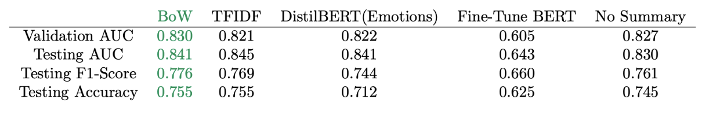
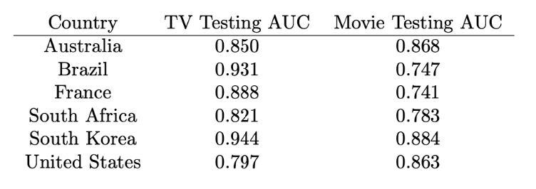

# Netflix Analytics Lab Project
MIT 15.572 Analytics Lab, in collaboration with Netflix

## Problem Statement
With the rise of streaming services, consumers are facing an abundance of choice. This begs the question - what makes content popular? We collaborated with Netflix in trying to understand the factors that influence content popularity. This analysis aims to assist Netflix’s strategy for producing and releasing new movies and TV shows by answering:
- What should Netflix look for in a new show before investing to maximise popularity? 
- Does having a certain cast and crew lead to greater success?
- How do preferences differ for different regions and countries?

## Methodology and Approach
First, preprocessing was conducted. This involved separating TV shows from movies such that separate models were developed for each content type. Data imputation was conducted (e.g., KNN imputation and mean imputation) for missing data points. Then, feature engineering was conducted to develop features proxying cast and crew popularity: number of votes, based on publicly available data on IMDb (e.g., the Marvel Cinematic Universe cast and crew tends to have a higher number of votes).

Second, NLP was applied to the synopses of each title from IMDb. First, this involved either stemming or lemmatizing each word in the synopses. Then, either Bag of Words or TFIDF was applied to merge the processed synopses with the existing tabular dataset of features.
- Bag of Words (BOW): Appending the counts of words directly
- TFIDF: Same as Bag of Words but a weight is associated with each count

Third, five types of models were tested: XGBoost, BERT (pre-trained Transformer), Random Forest, Logistic Regression, and Decision Trees. Once the best model was chosen, we used it to inform the strategy for new movies and TV shows by conducting SHAP feature importance analysis.

## Results and Discussion
We first identified the best performing models without incorporating synopses features. The model performances were as follows:

XGBoost was the best performing model amongst the five. We then incorporated synopses features into the XGBoost model and compared across different NLP preprocessing methodologies. The model performances were as follows:

The results shown are for movies but the same pattern was also seen with TV shows. XGB was the best performing and thus was selected for SHAP feature analysis. This was likely due to overfitting issues as BERT has significantly more parameters than XGB, whilst the dataset only contained ~2000 rows (approximately 1000 movies and 1000 TV shows). While the XGB model with BOW performed best (validation AUC), we selected the model that didn't utilise the summary or any synopses features. This is because the performance gain relative to computational cost was not worthwhile pursuing. Hence, the XGB model with no summary was selected for SHAP value analysis. The following was found on a global basis for some of the features.

| Features          | Movies             | TV Shows             |
|-------------------|--------------------|----------------------|
| Cast and crew (prioritise)    | Actors             | Writers and directors|
| Runtime length    | >100 mins (long)   | 45-60 mins (med/long)|
| Genre (top 3)     | Action/family/comedy| Drama/crime/romance |
| Release period    | Oct, Nov, Dec      | Oct, Nov, Dec        |
| Explicitness      | Severe             | Severe               |

To answer the question: “How do preferences differ for different regions and countries,” we trained a separate XGB model for a country from each continent to get a representative example of different markets. The results and some of the key findings were as follows for some of the countries:

**Movies**:
| Countries   | Key Features                                                   |
|-------------|----------------------------------------------------------------|
| USA         | Famous directors, actors, and writers; shorter run times; more severe mature content in thrillers and dramas |
| France      | Longer run times; severe mature content across genres; importance placed on directors |
| South Korea | Less profanity; less importance placed on directors in thrillers |

**TV Shows**:
| Countries     | Key Features                                                               |
|---------------|----------------------------------------------------------------------------|
| South Korea   | Preference for comedies and longer run times; fewer predicted top ten shows |
| Brazil        | Higher percentage of Spanish shows predicted to hit top ten                 |
| Commonalities | Animation shows prioritize good writers; fewer predicted top ten shows      |

## Report
[15.572 Final Report](./netflix-alab-report.pdf)

## Presentation
[15.572 Final Presentation](./netflix-alab-ppt.pdf)

